# Budgan Architecture

## 1. Overview

Budgan is a single-page Angular application for importing CSV bank statements and managing them as journals and accounts. All data lives in the browser (IndexedDB) — there is no server component. Users can export/import their entire dataset to a `.bdg` file using the File System Access API.

- **Framework**: Angular 21 (standalone components, signals, `OnPush` change detection)
- **UI**: Angular Material 21 + Material Icons + Roboto
- **Persistence**: IndexedDB via Dexie 4
- **i18n**: `@ngx-translate/core` with HTTP loader (`en`, `fr`)
- **Build/test**: Angular CLI (`@angular/build`) + Vitest
- **Source root**: `App/Budgan/`

## 2. Source layout

```
App/Budgan/
├── angular.json            # CLI config; assets served from public/
├── package.json
├── public/
│   ├── assets/i18n/        # en.json, fr.json (runtime translation files)
│   ├── assets/samples/     # sample.json (.bdg dataset bundled with the app)
│   ├── icons/              # Budgan{48,180,256,512}.png (PWA + header brand)
│   └── manifest.webmanifest
└── src/
    ├── main.ts             # bootstrapApplication(App, appConfig)
    ├── styles.scss
    ├── components/         # Reusable building blocks
    │   ├── app/            # Root component, routes, DI config, locale guard
    │   ├── header/         # Toolbar + brand button + page-title sub-component
    │   ├── main/           # Hosts the <router-outlet>
    │   ├── main-menu/
    │   ├── page/ + page-menu/ + page-body/
    │   ├── journal-list/
    │   ├── columns-mapping-list/
    │   ├── account-list/
    │   ├── account-snapshot/         # Balance-anchor form for an account
    │   ├── account-transactions-table/
    │   └── confirm-dialog/
    ├── views/              # Routed pages
    │   ├── Home/
    │   ├── journals/       (list, new, details)
    │   ├── columns-mapping/(new, details)
    │   ├── accounts/       (account-home + tabs: details, transactions, graphs;
    │   │                    plus new, import-file, save-account)
    │   ├── load/
    │   ├── save/
    │   └── samples/        # Loads bundled sample.json into IndexedDB
    ├── services/           # Interface + Impl pattern, registered in app.config.ts
    ├── Models/             # Plain TypeScript data shapes
    ├── types/              # Shared utility types (Result<T>)
    └── utils/              # Pure helpers (date.ts: ISO date parse/format)
```

TypeScript path aliases (`tsconfig.json`): `@components/*`, `@models/*`, `@services/*`, `@views/*`, `@app-types/*`.

## 3. Application bootstrap

`main.ts` → `bootstrapApplication(App, appConfig)`.

`App` (`src/components/app/app.ts`) is a thin shell that renders:
- `<app-header>` — toolbar with menu toggle, brand button (Budgan icon + title — uses `NgOptimizedImage` against `/icons/Budgan48.png`), page-title slot, locale switcher, theme toggle
- `<mat-sidenav-container>` — holds `<app-main-menu>` and `<main>`
- `<main>` — hosts the `<router-outlet>`

`appConfig` (`src/components/app/app.config.ts`) wires the global providers:
- `provideBrowserGlobalErrorListeners()`, `provideRouter(routes)`, `provideHttpClient()`, `provideAnimations()`
- `provideNativeDateAdapter()` — Angular Material datepicker support
- `provideTranslateService` + `provideTranslateHttpLoader` (prefix `/assets/i18n/`, suffix `.json`)
- `provideCharts(withDefaultRegisterables())` — `ng2-charts` registration used by the account graphs view
- `provideServiceWorker('ngsw-worker.js', { enabled: !isDevMode() })` — PWA support
- All service tokens → their `Impl` classes (see §6)

### Shell composition

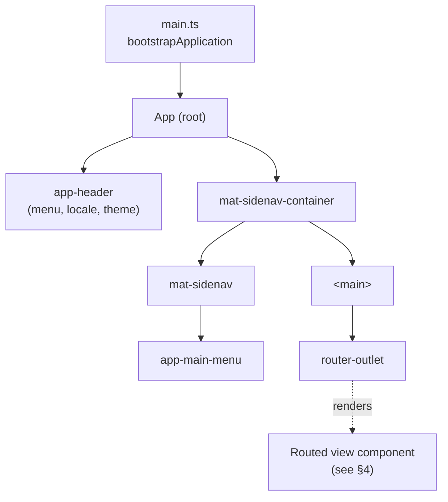

## 4. Routing & i18n guards

Routes are locale-prefixed and defined in `src/components/app/app.routes.ts`.

```
/                                       → defaultLocaleGuard → /<browser-locale> (renders JournalsComponent during redirect)
/:locale                                → localeGuard
  /                                     HomeComponent
  /journals                             JournalsComponent
  /journal/new                          NewJournalComponent
  /journal/:journalId                   JournalDetailsComponent
  /columns-mapping/new                  NewColumnsMappingComponent
  /columns-mapping/:columnsMappingId    ColumnsMappingDetailsComponent
  /account/new                          NewAccountComponent
  /account/:accountId                   AccountHomeComponent  (Material tab group:
                                          details | transactions | graphs)
  /account/:accountId/import-file       ImportFileComponent
  /account/:accountId/save              SaveAccountComponent
  /save                                 SaveComponent
  /load                                 LoadComponent
  /samples                              SamplesComponent
/**                                     → /en
```

`locale.guard.ts`:
- `defaultLocaleGuard` redirects `/` to `/<detected-locale>` via `LocaleService.detectBrowserLocale()`.
- `localeGuard` validates `:locale` is in `LocaleService.supportedLocales` (`en` | `fr`), then calls both `LocaleService.setLocale()` and `TranslateService.use()` so reactive UI and translation pipe stay in sync.

All component-driven navigation builds links via `this._router.navigate([locale, ...])` using the current locale signal.

### Route tree

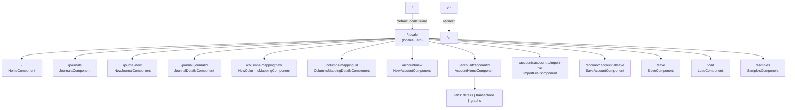

### View → reusable component dependencies

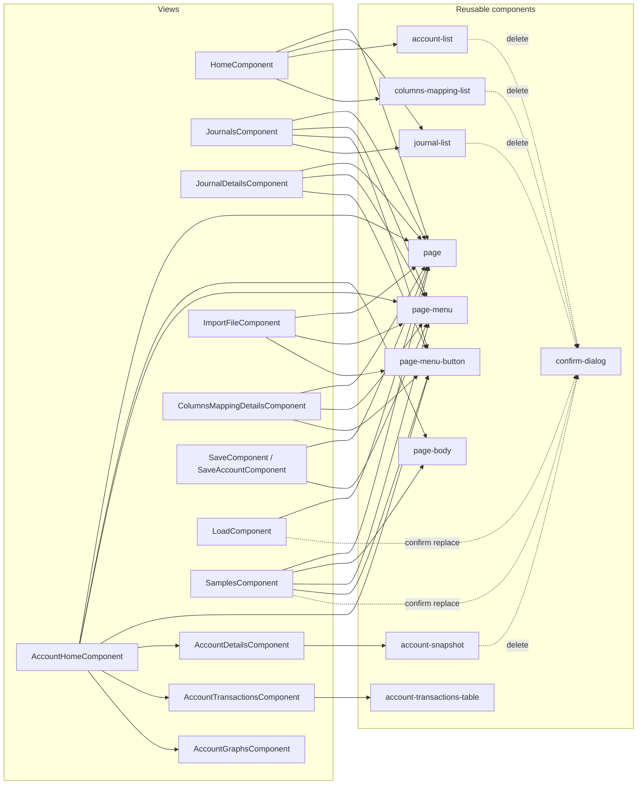

## 5. Domain model

Plain interfaces in `src/Models/` (no class methods, no behavior):

| Model | Purpose | Key fields |
|---|---|---|
| `JournalModel` | A user-named workspace | `id`, `name` |
| `AccountModel` | A bank account belonging to a user | `id`, `name`, `columnsMappingId`, `referenceBalance?` (`AccountReferenceBalance`) |
| `AccountReferenceBalance` | Opening balance pinned the day before the earliest transaction | `date` (ISO string), `balance` |
| `ColumnsMapping` | Maps CSV columns → semantic transaction fields | `id?`, `name`, `cardNumberColumnIndex` + `Text?`, `dateInscriptionColumnIndex` + `Text?`, `amountColumnIndex` + `Text?`, `descriptionColumnIndex` + `Text?` |
| `fileModel` | An imported CSV file (raw content kept) | `id`, `accountId`, `filename`, `content`, `insertionDate` |
| `AccountTransactionModel` | A single parsed transaction (or the snapshot anchor row) | `id`, `fileId`, `accountId`, `cardNumber`, `dateInscriptionAsString`, `amount`, `balance?`, `balanceDateOffset?`, `description`, `recordType` (`normal` \| `snapshot`) |

Snapshot rows live in the same `accountTransactions` table as normal rows. Their id is the literal `snapshot|<accountId>` (one per account) and `recordType = snapshot`. Normal transaction ids are the composite `${cardNumber}|${date}|${amount}|${description}`.

### Result type

`Result<T> = { success: true; value: T } | { success: false; error: string }` (`src/types/result.ts`). All fallible service operations return this shape rather than throwing; only "should never happen" lookups (e.g. `getById` for a known id) throw.

### Entity relationships

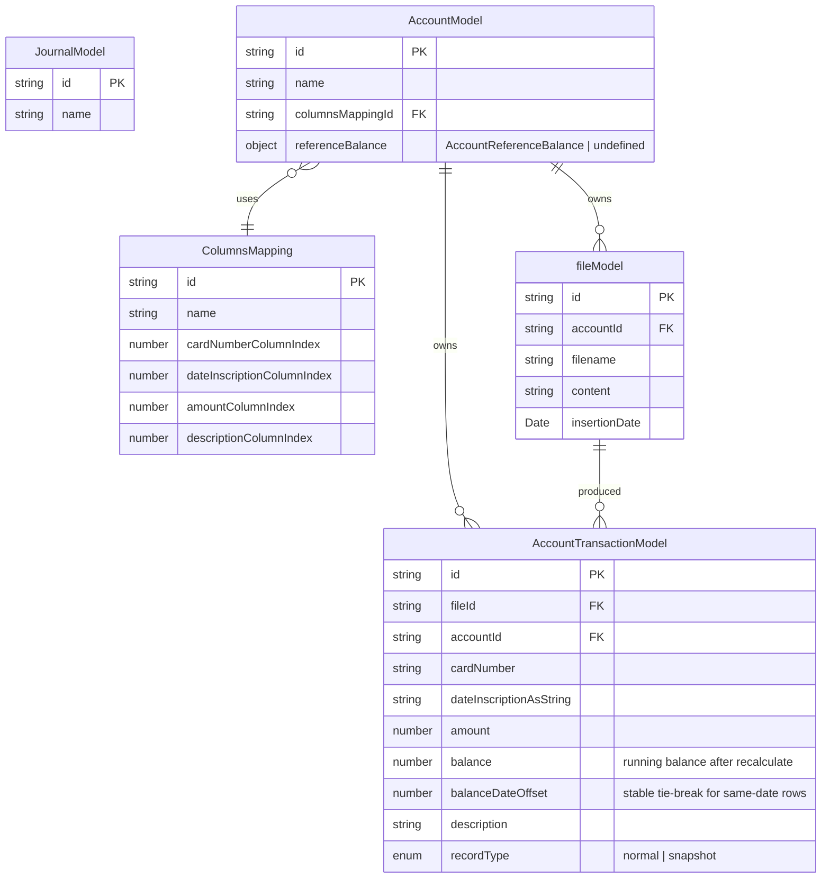

> `JournalModel` is the `workspaces` table; it exists as a workspace container but is not currently linked to accounts/files/transactions at the type level.

## 6. Service layer

Every service follows the **interface + `InjectionToken` + `Impl` class** pattern. Components and other services inject by token, never by concrete class. All tokens are registered in `app.config.ts`.

| Token | Implementation | Responsibility |
|---|---|---|
| `ID_GENERATOR_SERVICE` | `IdGeneratorServiceImpl` | `crypto.randomUUID()` wrapper for entity ids |
| `LOCALE_SERVICE` | `LocaleServiceImpl` | Holds `currentLocale` signal; detects browser locale; lists supported locales |
| `THEME_SERVICE` | `ThemeServiceImpl` | `isDark` signal; toggles `dark-theme` class on `<html>`; persists in `localStorage` |
| `JOURNAL_SERVICE` | `JournalServiceImpl` | CRUD on `workspaces` table |
| `ACCOUNT_SERVICE` | `AccountServiceImpl` | CRUD on `accounts` table |
| `COLUMNS_MAPPING_SERVICE` | `ColumnsMappingServiceImpl` | CRUD on `columnMappings` table (create or update via `save()`) |
| `FILE_SERVICE` | `FileServiceImpl` | CRUD on `files` table; query by `accountId` |
| `ACCOUNT_TRANSACTION_SERVICE` | `AccountTransactionServiceImpl` | CRUD + paginated/sorted read on `accountTransactions`; snapshot CRUD (`setSnapshot` / `getSnapshot` / `deleteSnapshot`); `recalculateBalances(accountId)` walks forward/backward from the snapshot to fill every row's `balance` + `balanceDateOffset`. Exposes a `transactionsVersion` signal so views re-fetch after writes. |
| `CSV_CONTENT_EXTRACTOR_SERVICE` | `CsvContentExtractorServiceImpl` | Pure CSV → JSON parsing (delimiter detection, header scoring, row extraction) |
| `BUDGAN_EXPORT_SERVICE` | `BudganExportServiceImpl` | File System Access API; builds & reads `.bdg` payloads |

Two UI-state holders are intentionally **not** tokenized — they are pure local-state services and are injected by class:

| Service | State | Used by |
|---|---|---|
| `MainMenuService` | `isOpen` signal; `toggleMenu()` / `close()` | `App` shell sidenav, `<app-header>` menu button |
| `PageService` | `title` signal; `setTitle(string)` | All page views set their title; `<app-header-page-title>` reads it |

`IndexdbService` is also injected by class directly (it extends `Dexie`).

### Conventions
- Use `inject()` inside the `Impl` body, never constructor parameters.
- Services that mutate persistent state return `Promise<Result<T>>`.
- Read-only helpers (`getList`, `getListByAccount`) return `Promise<T[]>` directly.
- `getById` throws if the id is unknown — callers treat the result as guaranteed.

### Service dependency graph

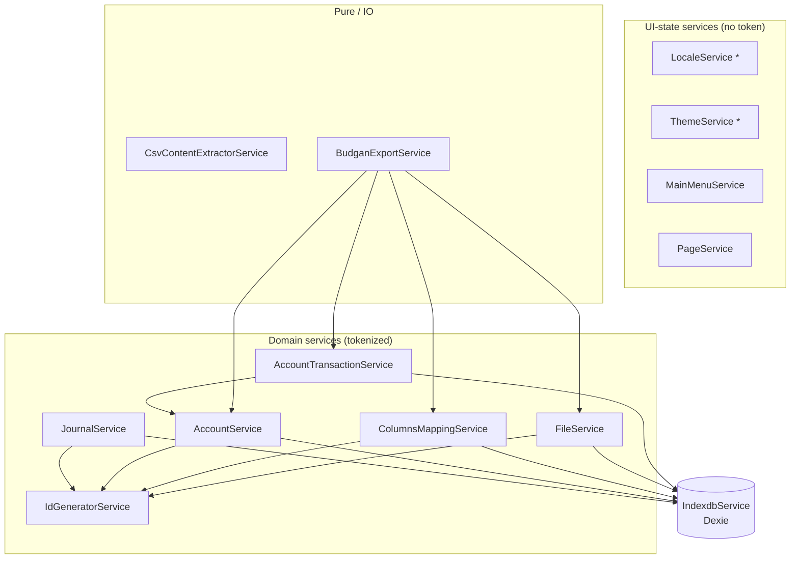

`*` = tokenized (`LOCALE_SERVICE`, `THEME_SERVICE`); `MainMenuService` / `PageService` are injected by class.

## 7. Persistence (Dexie / IndexedDB)

`IndexdbService` extends `Dexie('budgan')` and owns the schema. It is `providedIn: 'root'` and exposed as a concrete class (no token) since there is one obvious implementation.

**Current schema (version 8):**

| Table | Indexes | Stored entity |
|---|---|---|
| `workspaces` | `&id, &name` | `JournalModel` |
| `columnMappings` | `&id, &name` | `ColumnsMapping` |
| `accounts` | `&id, &name` | `accountModel` |
| `files` | `&id, filename, accountId` | `fileModel` |
| `accountTransactions` | `&id, accountId, fileId` | `AccountTransactionModel` |

Versions 1–8 are kept in `indexdb.service.ts` so existing databases can migrate forward. **Adding a new table or index requires a new `version(N).stores({ ... })` entry** — never edit a published version.

### Transactional helpers
- `clearAll()` — wipes every table in a single `rw` transaction. Used by the "Clear all" UI action.
- `replaceAll(payload)` — clears every table and bulk-adds the contents of a loaded `.bdg` payload (workspaces are not in the payload yet).

### Tables and indexes

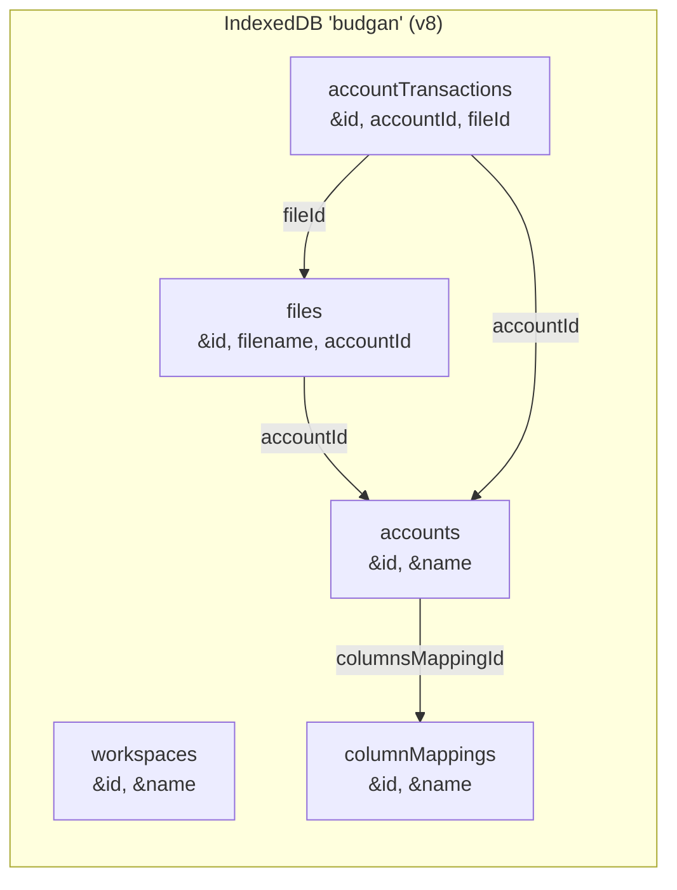

## 8. CSV import pipeline

The CSV → transactions flow is split across three services and the `ImportFileComponent`. The flow for `/{locale}/account/:accountId/import-file`:

1. **File selection** — user picks a `.csv`; component reads `file.text()`.
2. **Extraction** — `CsvContentExtractorService.extract(text)`:
   - Splits on `\r?\n`, ignores blank lines.
   - Detects delimiter by scoring `,` `;` `\t` `|` against most-common column count.
   - Picks header row by scoring the first 10 candidates (alpha chars, non-numeric, uniqueness).
   - Normalizes headers (`lowercase`, non-alphanumerics → `_`, dedupes with `_2`, `_3`...).
   - Returns `Result<{ delimiter, headerRowIndex, header, rows }>`.
3. **Mapping resolution** — component loads the account and its `ColumnsMapping`.
4. **Persistence** — creates a `fileModel` row holding the raw CSV content, then iterates `rows` and writes one `AccountTransactionModel` per parseable row. The transaction `id` is the composite `${cardNumber}|${date}|${amount}|${description}` — duplicates fail the `&id` unique index (the `add` simply rejects, so re-importing the same statement is a no-op).
5. **Balance recompute** — after the rows are written, the component (or follow-on snapshot edit) calls `AccountTransactionService.recalculateBalances(accountId)`, which fills `balance` + `balanceDateOffset` on every row anchored on the snapshot (or 0 if there is none) and updates `AccountModel.referenceBalance`.
6. **Navigation** — redirects back to `/{locale}/account/:accountId`.

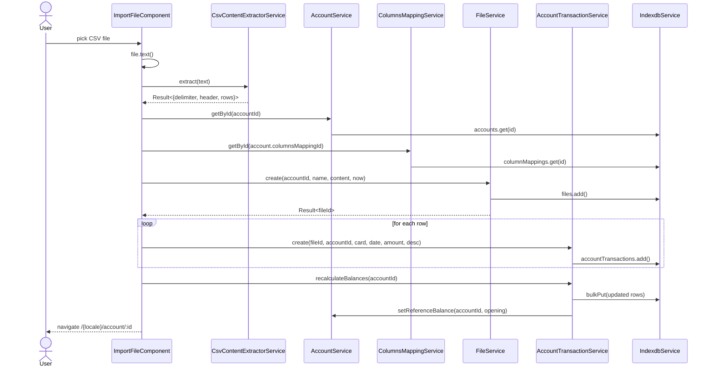

## 9. Save / load (.bdg export)

`BudganExportService` wraps the File System Access API (`showSaveFilePicker`, `showOpenFilePicker`) and the payload builders.

### Account-scoped payload (`AccountExportPayload`, version 1)
```
{ version, account, columnsMapping, files[], transactions[] }
```
Used by `SaveAccountComponent` to export a single account's data.

### Full-dataset payload (`AllDataExportPayload`, version 1)
```
{ version, columnsMappings[], accounts[], files[], transactions[] }
```
Used by `SaveComponent` (export everything except journals) and `LoadComponent`, which calls `IndexdbService.replaceAll(payload)` after the picker returns a valid file.

`readAllDataPayload()` validates the parsed JSON with `isAllDataExportPayload()` and returns `Result<...>` — invalid files surface as `parse-error` or `invalid-format` rather than throwing.

### Save flow (all data)

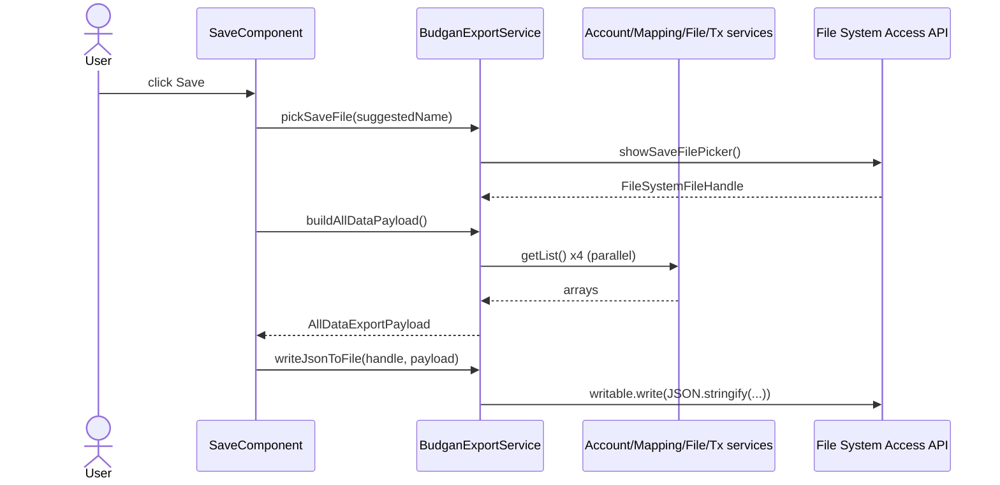

### Load flow (all data)

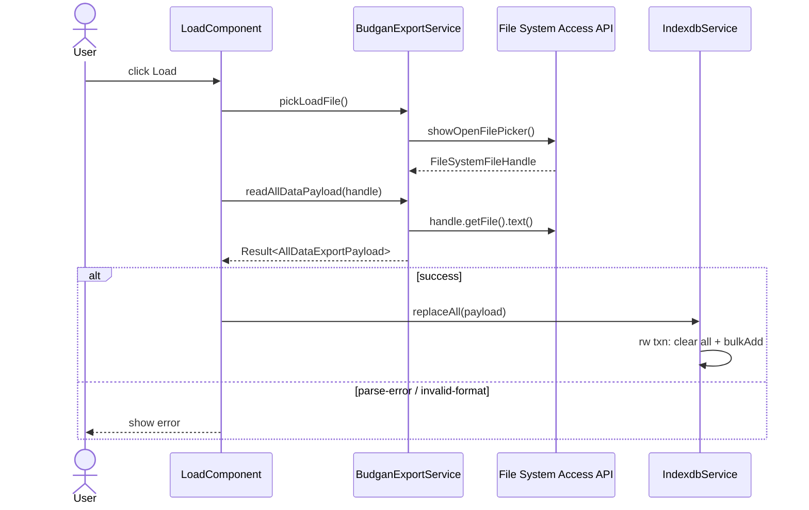

## 10. Account snapshot & running balances

A "snapshot" is a single known-true balance the user enters for an account at a specific date. It is stored as one extra row in `accountTransactions` with `recordType = snapshot` and `id = snapshot|<accountId>` (so there is at most one per account).

`AccountTransactionService.recalculateBalances(accountId)` is the engine that turns transactions into running balances. It is invoked by `setSnapshot`, `deleteSnapshot`, and whenever transactions are mutated.

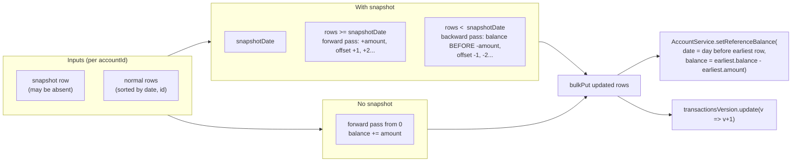

Views that depend on transactions (`AccountTransactionsComponent`, `AccountGraphsComponent`) read `transactionsVersion` via an `effect()` and re-fetch when it bumps.

## 11. PWA & graphs

- **PWA**: `provideServiceWorker('ngsw-worker.js', { enabled: !isDevMode() })` registers the Angular service worker only in production builds. Manifest at `public/manifest.webmanifest`; PNG icons at `public/icons/Budgan{48,180,256,512}.png`.
- **Charts**: `AccountGraphsComponent` uses `ng2-charts` (registered globally via `provideCharts(withDefaultRegisterables())`) to plot balance history from the recalculated `balance` field.
- **Bundled sample data**: `SamplesComponent` (`/samples`) fetches `/assets/samples/sample.json`, validates it through `BudganExportService.parseAllDataPayload()`, and replaces every IndexedDB table via `IndexdbService.replaceAll()` after a confirm dialog. Useful for first-run demos.

## 12. State management

There is no central store. State lives in four places:

1. **IndexedDB** (via Dexie) — the source of truth for all persistent domain data.
2. **Service-held signals** — small pieces of cross-component UI state:
   - `LocaleService.currentLocale`
   - `ThemeService.isDark`
   - `MainMenuService.isOpen`
   - `PageService.title` — current page title shown in the header.
3. **Cache-invalidation signal**: `AccountTransactionService.transactionsVersion` is bumped after every mutation (`create`, `setSnapshot`, `deleteSnapshot`, `recalculateBalances`); transaction-dependent views re-fetch by reading it in an `effect()`.
4. **Component-local signals** — page-specific view state (`signal()`, `computed()`). Async fetches store results into component signals; no observables-as-state.

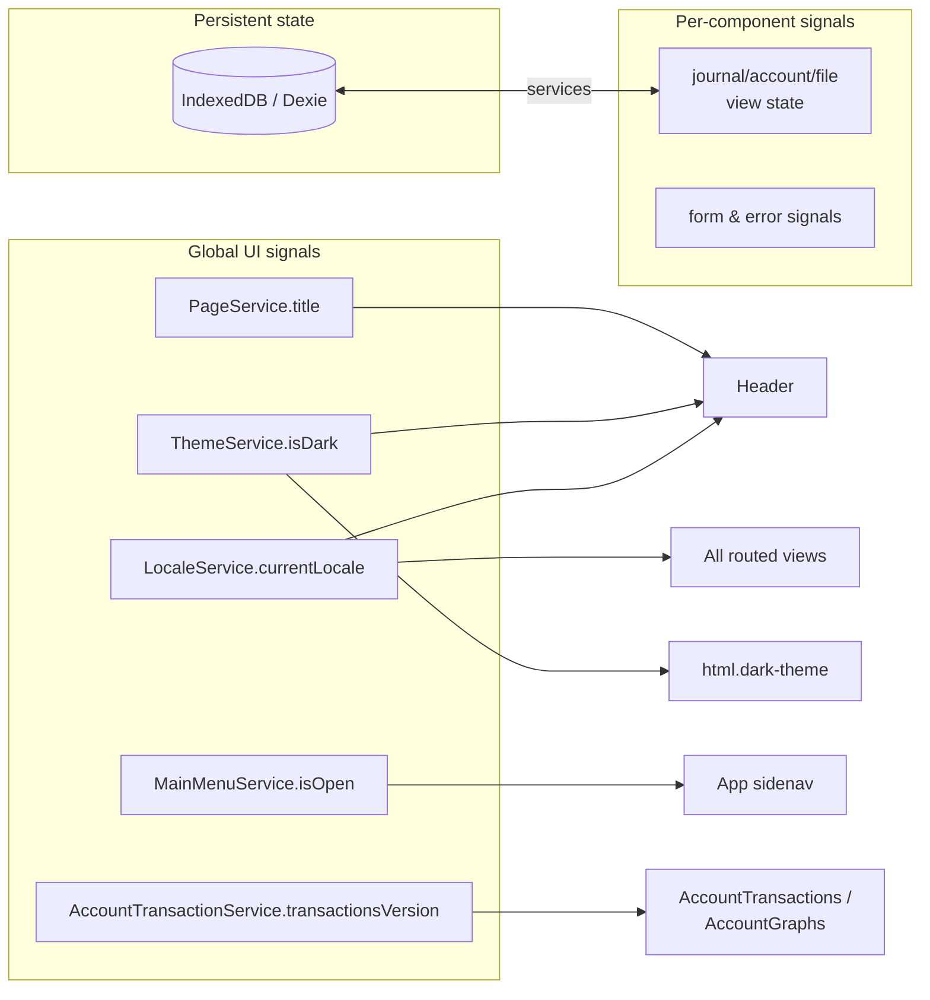

## 13. Component conventions

Enforced across the codebase (see `App/Budgan/.claude/CLAUDE.md` for the full list):

- Standalone components (do **not** set `standalone: true` — it's the default in v20+).
- `changeDetection: ChangeDetectionStrategy.OnPush` on every `@Component`.
- Signals only — no `@Input`/`@Output` decorators; use `input()` / `output()`.
- Native control flow (`@if`, `@for`, `@switch`) — no `*ngIf`/`*ngFor`/`*ngSwitch`.
- No `ngClass`/`ngStyle` — use `class.x`/`style.x` bindings.
- No `@HostBinding`/`@HostListener` — use the `host` object on the decorator.
- `inject()` in the body, not constructor parameters.
- Components using `| translate` must add `TranslatePipe` to their `imports`.
- Static `` must use `NgOptimizedImage` with explicit `width`/`height` (see the brand button in `<app-header>` for the pattern). Inline base64 images are out of scope for `NgOptimizedImage`.
- Interactive elements carry `data-testid="kebab-case"` for tests.

## 14. Theming

Light/dark theming uses Material 3 CSS system variables. `ThemeService` toggles a `dark-theme` class on `<html>` and persists the choice in `localStorage`.

**Rule**: any color in component styles must use `--mat-sys-*` variables. Fallbacks must be `inherit`, not literal RGB — a hard-coded fallback like `rgba(0,0,0,0.6)` silently breaks dark mode.

```scss
color: var(--mat-sys-on-surface-variant, inherit);  /* correct */
```

## 15. Internationalization

- Loader: `provideTranslateHttpLoader({ prefix: '/assets/i18n/', suffix: '.json' })`.
- Translation files live in `public/assets/i18n/` — Angular CLI only serves `public/`, so files under `src/assets/` are unreachable at runtime.
- Templates use `{{ 'menu.newJournal' | translate }}`. Keys are dot-namespaced and must be present in **both** `en.json` and `fr.json`.
- `localeGuard` calls `TranslateService.use(locale)` on every route activation, so the language follows the URL.

## 16. Testing & tooling

- **Unit tests**: Vitest with jsdom. Run via `ng test` (Angular CLI builder).
- **Formatting**: Prettier (`npx prettier --write .`).
- **TypeScript**: strict mode, plus `noImplicitOverride`, `noPropertyAccessFromIndexSignature`, `strictTemplates`.
- **Path aliases**: declared in `tsconfig.json` (`@components/*`, `@models/*`, `@services/*`, `@views/*`, `@app-types/*`, plus `@/*` → `src/*`).
- **PWA**: built via the Angular service worker. The service worker is **disabled in dev** (`isDevMode()` short-circuits registration); a production build (`ng build`) ships `ngsw-worker.js` and `manifest.webmanifest`.

## 17. Tools directory

`Tools/StatementGenerator/` is a standalone Node 20+ utility that generates mock CSV bank statements for testing the import pipeline. It is not part of the Angular bundle.

## 18. Extending the application

Checklist for the most common changes:

| Change | Where |
|---|---|
| New service | Interface + `InjectionToken` + `Impl` class in `src/services/`. Register provider in `app.config.ts`. |
| New entity needing an id | Inject `ID_GENERATOR_SERVICE` and call `generateId()`. |
| New persisted table or index | Add a new `version(N).stores({ ... })` entry to `IndexdbService`; keep prior versions intact. |
| Fallible operation | Return `Result<T>`, do not throw. |
| New component | Standalone (no flag), `OnPush`, signals for state, `data-testid` on interactive nodes. |
| New route | Add under `/:locale` in `app.routes.ts`; use the locale signal when building navigation arrays. |
| New i18n key | Add to both `public/assets/i18n/en.json` and `fr.json`. |
| New `.bdg` field | Bump `version` in the payload type, extend the `parseAllDataPayload` validator, and handle the older `version` on load. |
| New static image | Place under `public/`; reference with `NgOptimizedImage` (``). |
| New page that needs a header title | Inject `PageService` in the view and call `setTitle('i18n.key')` (translation happens at the consumer). |
| New account-transaction mutation | After writing, call `AccountTransactionService.recalculateBalances(accountId)` so running balances and `referenceBalance` stay consistent. |