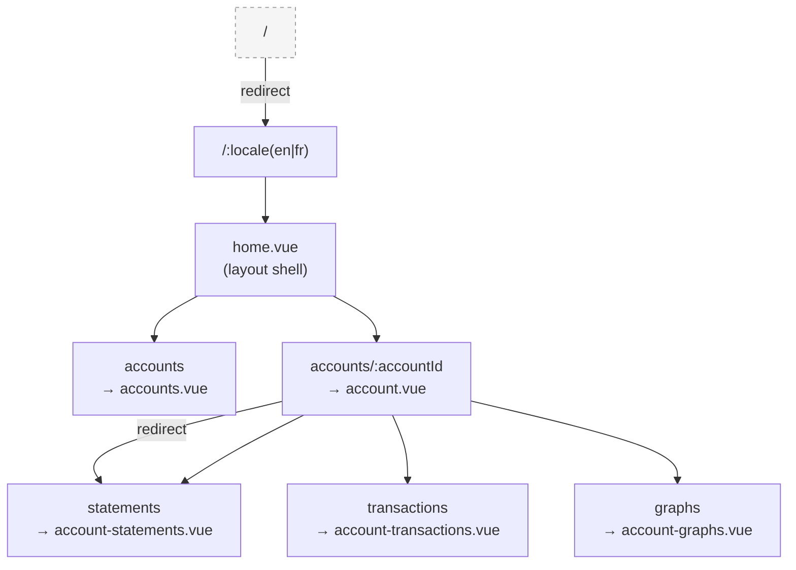
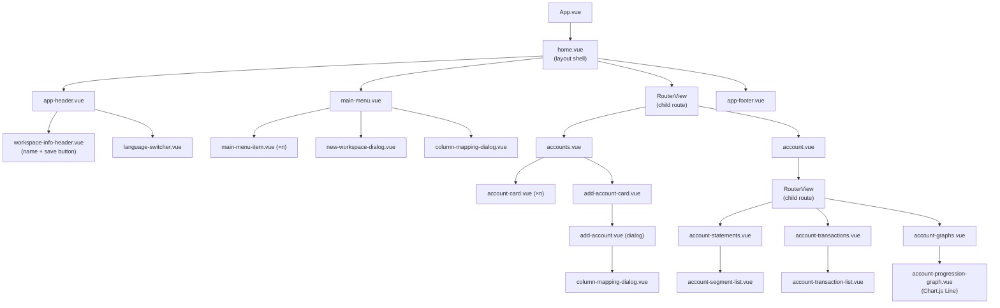
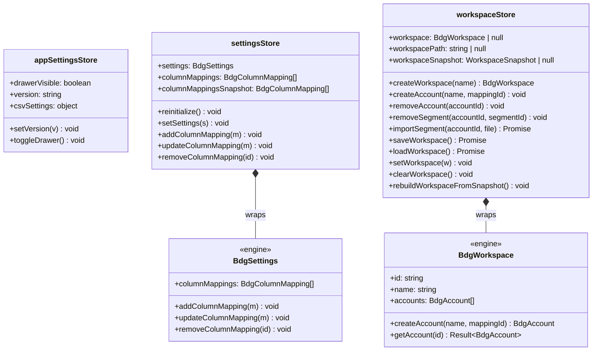
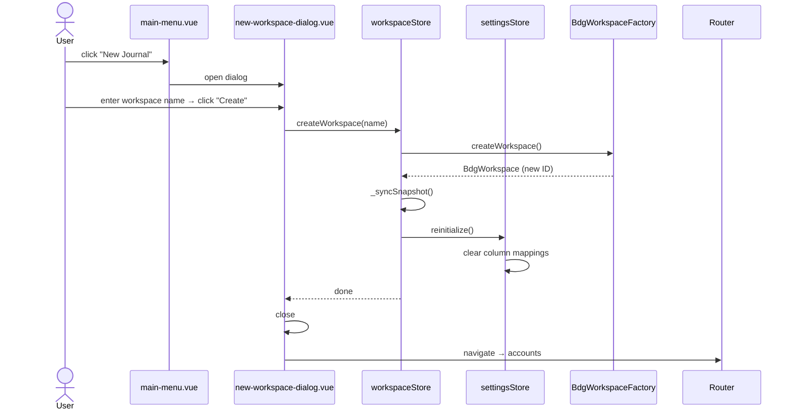
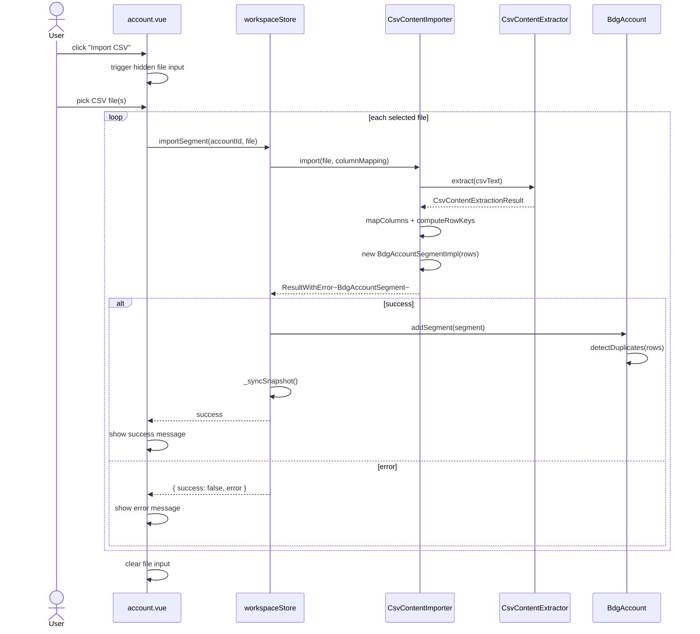
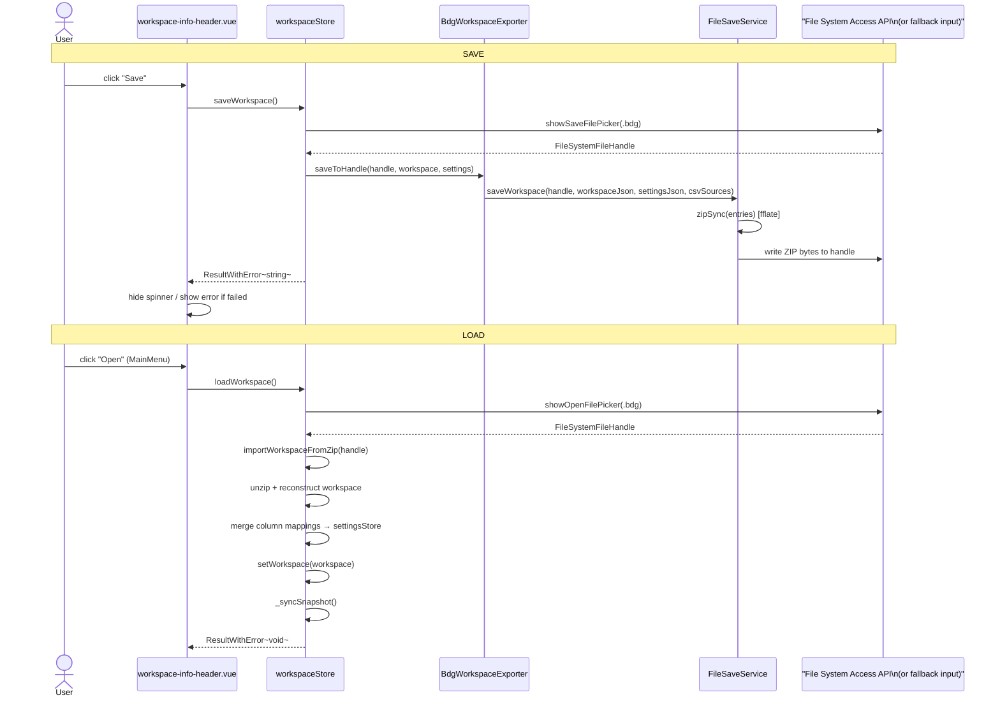
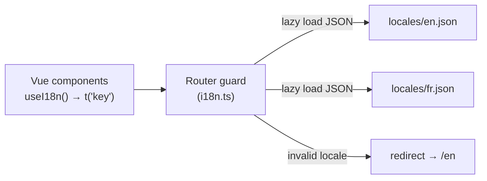

# Budgan Application Architecture

> Source root: `App/src/budgan/`  
> Vue 3 + TypeScript + Vuetify 3 + Pinia — port 8000 (scaffolded, not yet active)  
> The active reference implementation lives in `src/engine-testapp/` (port 8001).

---

## Table of Contents

1. [Module Overview](#1-module-overview)
2. [Routing](#2-routing)
3. [Component Tree](#3-component-tree)
4. [State Management](#4-state-management)
5. [Data Flow Diagrams](#5-data-flow-diagrams)
   - 5.1 [Workspace Creation](#51-workspace-creation)
   - 5.2 [CSV Import](#52-csv-import)
   - 5.3 [Workspace Save / Load](#53-workspace-save--load)
6. [i18n](#6-i18n)
7. [Styling System](#7-styling-system)
8. [Testing](#8-testing)

---

## 1. Module Overview

```
src/budgan/
├── assets/
│   ├── settings.json          ← App version (0.0.0.1)
│   └── colors-def.scss        ← CSS custom property definitions
├── components/
│   ├── account/               ← Account-scoped components + sub-components
│   │   └── graphs/
│   └── *.vue                  ← Shared/layout components + dialogs
├── i18n/
│   ├── i18n.ts                ← vue-i18n setup, lazy locale loading
│   └── locales/
│       ├── en.json            ← 80 keys
│       └── fr.json            ← 80 keys (French)
├── router/
│   ├── index.ts               ← Vue Router config (locale-prefixed routes)
│   └── routeTracker.ts        ← Stores "from" path in route meta
├── stores/
│   ├── appSettings-store.ts   ← UI state (drawer, version) — not persisted
│   ├── settings-store.ts      ← Column mappings — persisted to localStorage
│   └── workspace-store.ts     ← Workspace domain — persisted to localStorage
├── styles/
│   └── Colors.ts              ← useThemeColors() helper
└── views/
    ├── home.vue               ← Root layout
    ├── accounts.vue           ← Account list
    └── account*.vue           ← Account detail, statements, transactions, graphs
```

**Dependency boundary:** stores import from `@engine/` — all other layers (components, views) talk only to stores and never to engine types directly.

---

## 2. Routing

All routes are **locale-prefixed** (`/:locale(en|fr)/`). An i18n route guard lazily loads the locale JSON and redirects `/` → `/en`.



| Route name | Path | View |
|---|---|---|
| *(root)* | `/` | redirect → `/en` |
| `home` | `/:locale` | `home.vue` |
| `accounts` | `/:locale/accounts` | `accounts.vue` |
| `account` | `/:locale/accounts/:accountId` | `account.vue` (redirect → statements) |
| `account-statements` | `/:locale/accounts/:accountId/statements` | `account-statements.vue` |
| `account-transactions` | `/:locale/accounts/:accountId/transactions` | `account-transactions.vue` |
| `account-graphs` | `/:locale/accounts/:accountId/graphs` | `account-graphs.vue` |

Construct links as:
```vue
<RouterLink :to="{ name: 'accounts', params: { locale: localeParam } }">
```

---

## 3. Component Tree



### Component Responsibilities

| Component | Responsibility |
|---|---|
| `app-header.vue` | Top bar — menu toggle, title, workspace name, save button, language switcher |
| `main-menu.vue` | Navigation drawer — workspace actions, new/open/clear workspace |
| `main-menu-item.vue` | Single icon+label nav item, emits `click` |
| `workspace-info-header.vue` | Workspace name + save status spinner + error snackbar |
| `language-switcher.vue` | `v-select` for `en`/`fr` locale switching |
| `app-footer.vue` | App version display |
| `new-workspace-dialog.vue` | Modal — workspace name input, creates workspace via store |
| `add-account.vue` | Modal — account name + column mapping picker, creates account via store |
| `add-account-card.vue` | Placeholder card that opens `add-account.vue` |
| `account-card.vue` | Displays one account with date range and segment count; emits delete |
| `column-mapping-dialog.vue` | Full mapping editor — CSV file picker, 5-field mapper, save/update/delete |
| `account-segment-list.vue` | Lists segments with date range, row count, and unique-count badges |
| `account-transaction-list.vue` | Flattened transaction table — sortable columns, duplicate toggle, amount color |
| `account-progression-graph.vue` | Chart.js `Line` chart of running balance over time |

---

## 4. State Management

Three Pinia stores form the state layer. Only `settingsStore` and `workspaceStore` are persisted.



### Persistence strategy

| Store | localStorage key | What is persisted | Rehydration |
|---|---|---|---|
| `appSettingsStore` | — | Nothing | — |
| `settingsStore` | `budgan-settings` | `columnMappingsSnapshot` | `afterHydrate`: calls `addColumnMapping` for each snapshot entry |
| `workspaceStore` | `budgan-workspace` | `workspaceSnapshot` | `afterHydrate`: calls `rebuildWorkspaceFromSnapshot()` |

`BdgWorkspace` and `BdgSettings` are live class instances — they cannot be JSON-serialised directly. Snapshots hold plain-object representations; rehydration reconstructs the live objects via `BdgWorkspaceFactory` and `BdgAccountImpl`.

#### WorkspaceSnapshot shape

```typescript
type WorkspaceSnapshot = {
  id: string
  name: string
  accounts: Array<{
    id: string
    name: string
    columnMappingId: string
    segments: Array<{
      id: string
      name: string
      rows: Array<{
        key: string
        cardNumber: string
        description: string
        dateTransactionAsString: string
        dateInscriptionAsString?: string
        amount: number
      }>
    }>
  }>
}
```

`Date` objects are **not** stored — they are re-derived from `*AsString` fields using `moment` (local timezone) during rehydration.

---

## 5. Data Flow Diagrams

### 5.1 Workspace Creation



---

### 5.2 CSV Import



---

### 5.3 Workspace Save / Load



---

## 6. i18n

Two locales are supported: `en` and `fr`. Locale JSON files are loaded lazily by the router guard when the `:locale` param changes.



### Key namespace summary

| Namespace | Keys | Used by |
|---|---|---|
| `app.*` | `title` | `app-header` |
| `mainMenu.*` | `newWorkspace`, `openWorkspace`, `accounts`, `columnMapping`, `clearWorkspace`, `loadWorkspaceError` | `main-menu` |
| `newWorkspaceDialog.*` | `title`, `nameLabel`, `cancel`, `create` | `new-workspace-dialog` |
| `accounts.*` | `title`, `noWorkspace`, `addAccount`, … (8 keys) | `accounts.vue`, `account-card` |
| `columnMapping.*` | `title`, `description`, `savedMappings`, `fieldCardNumber`, … (18 keys) | `column-mapping-dialog` |
| `account.*` | `notFound`, `importCsv`, `progressionGraph.*`, `transactionList.*` (18 keys) | `account.vue` and sub-views |
| `workspaceInfoHeader.*` | `save`, `saving`, `saveError` | `workspace-info-header` |
| `languageSwitcher.*` | `label`, `english`, `french` | `language-switcher` |

All keys must exist in **both** `en.json` and `fr.json`.

---

## 7. Styling System

Every component uses **scoped BEM styles** and imports the shared color token file.

```scss
<style scoped>
  @use '@budgan/assets/colors-def.scss';

  .account-card { ... }
  .account-card__title { ... }
  .account-card__amount--negative { color: var(--bdg-error); }
</style>
```

### CSS custom properties (defined in `colors-def.scss`)

| Token | Usage |
|---|---|
| `--bdg-primary` | Brand primary colour |
| `--bdg-on-primary` | Text on primary backgrounds |
| `--bdg-primary-darken-1` | Hover / pressed primary |
| `--bdg-secondary` | Secondary accent |
| `--bdg-secondary-darken-1` | Hover / pressed secondary |
| `--bdg-on-secondary` | Text on secondary |
| `--bdg-surface` | Card / panel background |
| `--bdg-on-surface` | Default text |
| `--bdg-on-surface-variant` | Muted / secondary text |
| `--bdg-background` | Page background |
| `--bdg-accent` | Success / positive amounts (green) |
| `--bdg-error` | Error / negative amounts (red) |
| `--v-border-color` | Dividers and borders (Vuetify) |

**Never hardcode colour values** — always use `var(--token-name)`.  
Mobile breakpoint: `@media (max-width: 640px)`.

### `useThemeColors()` helper (`styles/Colors.ts`)

Reads the above tokens from computed CSS at runtime for use in JavaScript (e.g. Chart.js configuration):

```typescript
const { accent, error, surfaceVariant, separator } = useThemeColors()
```

---

## 8. Testing

Tests live alongside the files they test (`*.spec.ts`).

| File | Tests |
|---|---|
| `components/account/account-card.spec.ts` | Card renders account data; delete button emits event |
| `components/account/account-transaction-list.spec.ts` | Table renders rows; sort; duplicate toggle |
| `components/app-header.spec.ts` | Header renders; menu toggle; workspace name display |
| `components/language-switcher.spec.ts` | Locale select emits correct value |
| `stores/workspace-store.spec.ts` | Snapshot round-trip; file picker API vs fallback |

**Stack:** Vitest + `@vue/test-utils` (`shallowMount` / `mount`)

**Mocking conventions:**

```typescript
// Pinia stores
const store = useMockStore(useWorkspaceStore, { workspace: null })

// Vue Router
vi.mock('vue-router', () => ({ useRoute: vi.fn(), useRouter: vi.fn() }))

// vue-i18n
vi.mock('vue-i18n', () => ({ useI18n: () => ({ t: (k: string) => k }) }))

// File System Access API
vi.spyOn(window, 'showSaveFilePicker').mockResolvedValue(mockHandle)
```

All Vuetify components are stubbed in unit tests to keep tests focused on component logic rather than library rendering.
