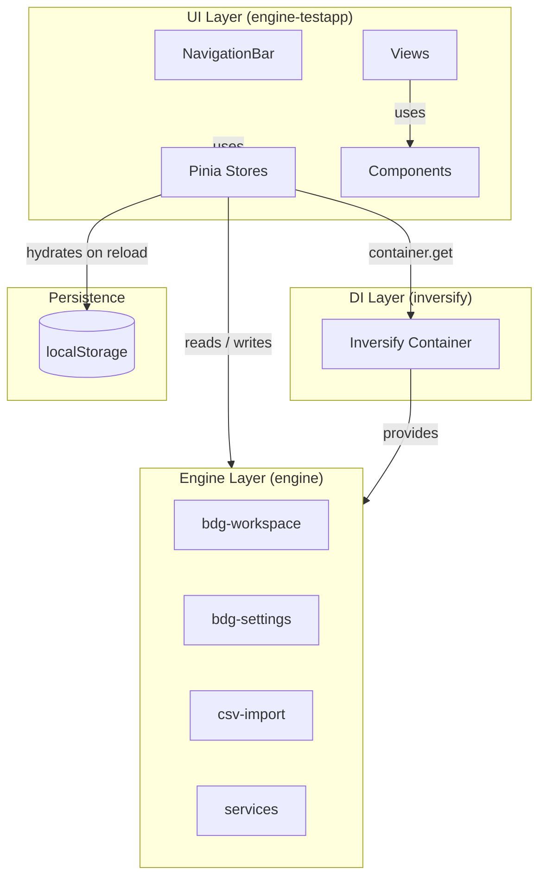
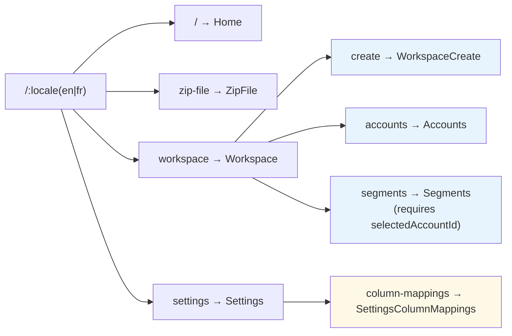
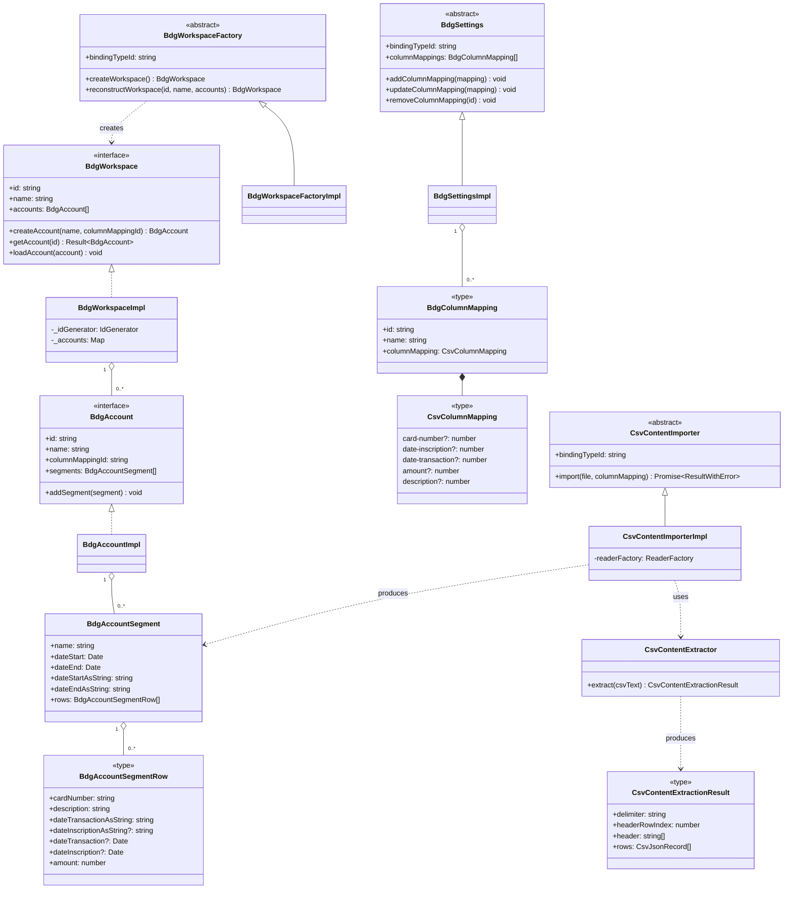
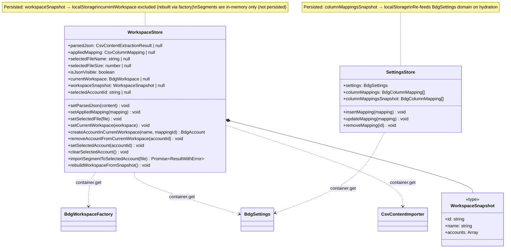
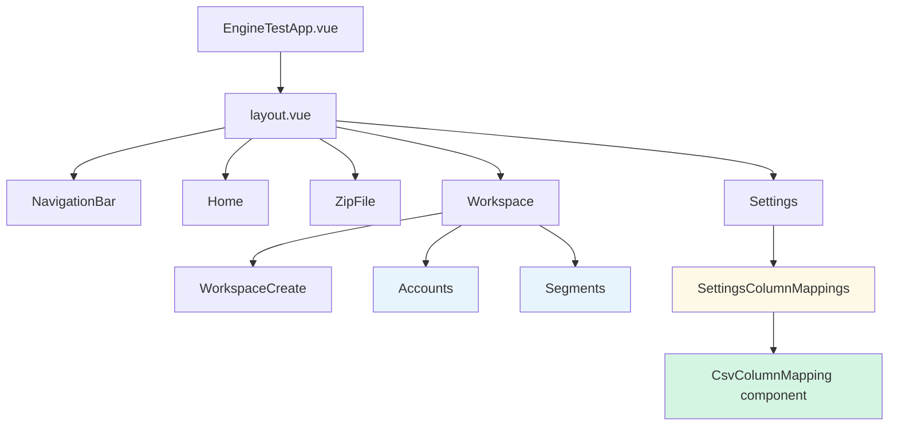
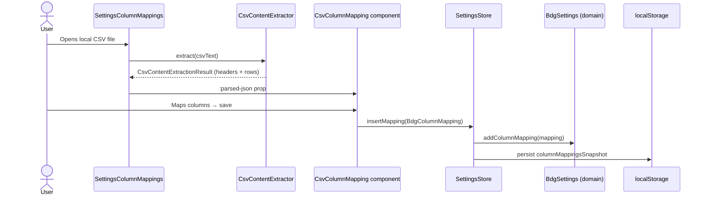
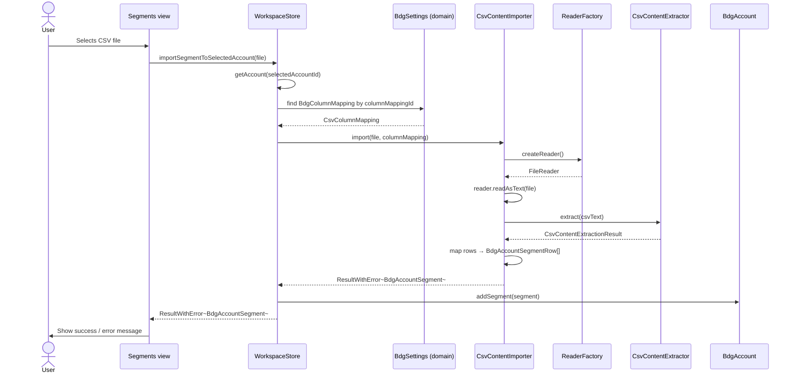
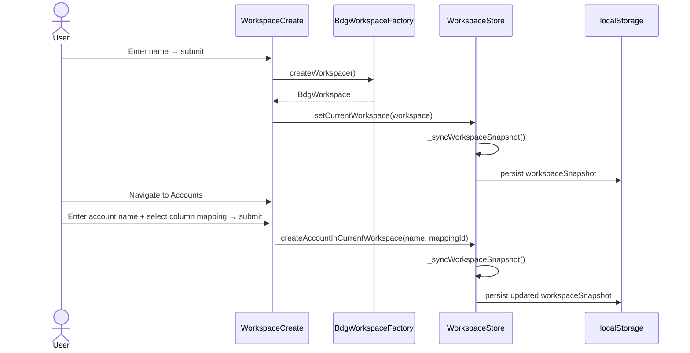
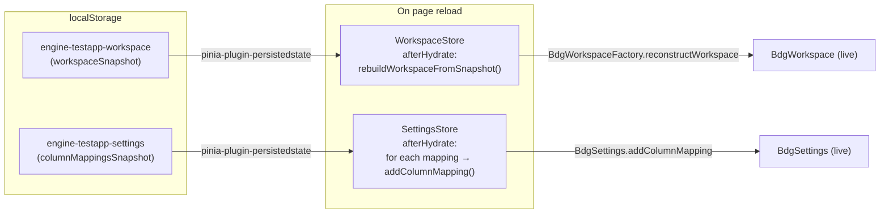

# Engine TestApp — Architecture

The `engine-testapp` is a Vue 3 application that acts as an interactive harness for the Budgan engine layer. It lets developers create workspaces, define column mappings, and import CSV bank statements through the full engine pipeline.

---

## 1. Layer Overview

---

## 2. Routing Tree

---

## 3. Domain Model (Engine Layer)

---

## 4. Pinia Stores

---

## 5. Component Tree

---

## 6. CSV Import Data Flow

---

## 7. Segment Import Flow

---

## 8. Workspace Creation Flow

---

## 9. Persistence & Hydration

---

## 10. DI Container Bindings

| Abstract Class (token) | Concrete Class | Scope |
|---|---|---|
| `BdgWorkspaceFactory` | `BdgWorkspaceFactoryImpl` | Singleton |
| `BdgSettings` | `BdgSettingsImpl` | Singleton |
| `IdGenerator` | `IdGeneratorImpl` | Transient |
| `ReaderFactory` | `FileReaderFactoryImpl` | Transient |
| `CsvContentImporter` | `CsvContentImporterImpl` | Transient |

All bindings are declared in `engine/setup-inversify.module.ts` and loaded into the shared Inversify container at `inversify/setup-inversify.ts`.

---

## 11. Key Conventions

| Rule | Description |
|---|---|
| `Bdg` prefix | All domain entities (e.g. `BdgWorkspace`, `BdgAccount`, `BdgSettings`) |
| `Impl` suffix | All concrete implementations (e.g. `BdgWorkspaceImpl`) |
| Abstract class as DI token | Abstract classes carry a static `bindingTypeId` — never raw interfaces |
| `Result<T>` | Fallible operations return `{ success: true, value: T }` or `{ success: false }` |
| BEM CSS | All scoped styles use BEM (e.g. `.workspace-view__menu-item--active`) |
| i18n | All user-visible strings go through `useI18n()` / `t('...')` |
| Locale routing | All routes prefixed with `/:locale(en|fr)/` |
| Path aliases | `@engine/`, `@inversify/`, `@engineTestApp/`, `@engineTestAppViews/`, `@engineTestAppRouter/` |
| `data-testid` | All interactive/testable elements carry a `data-testid` attribute |

