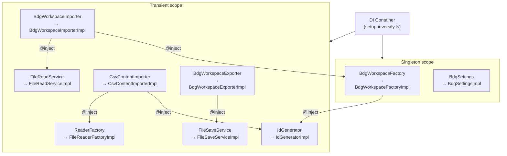
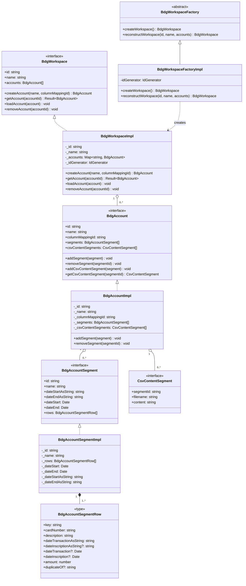
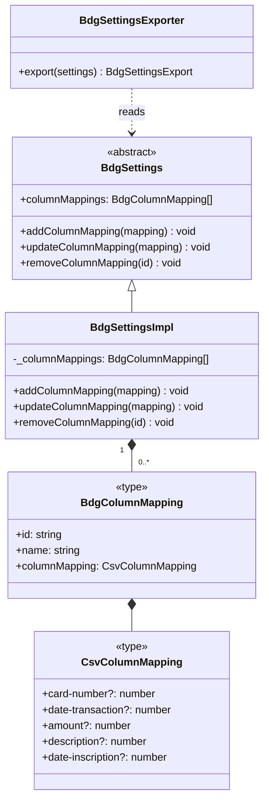
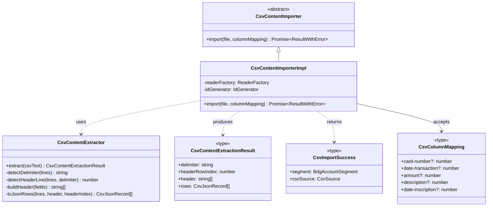
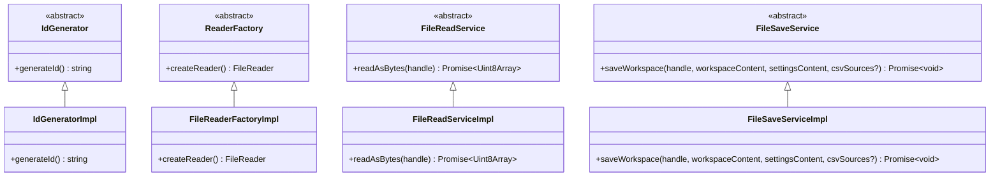
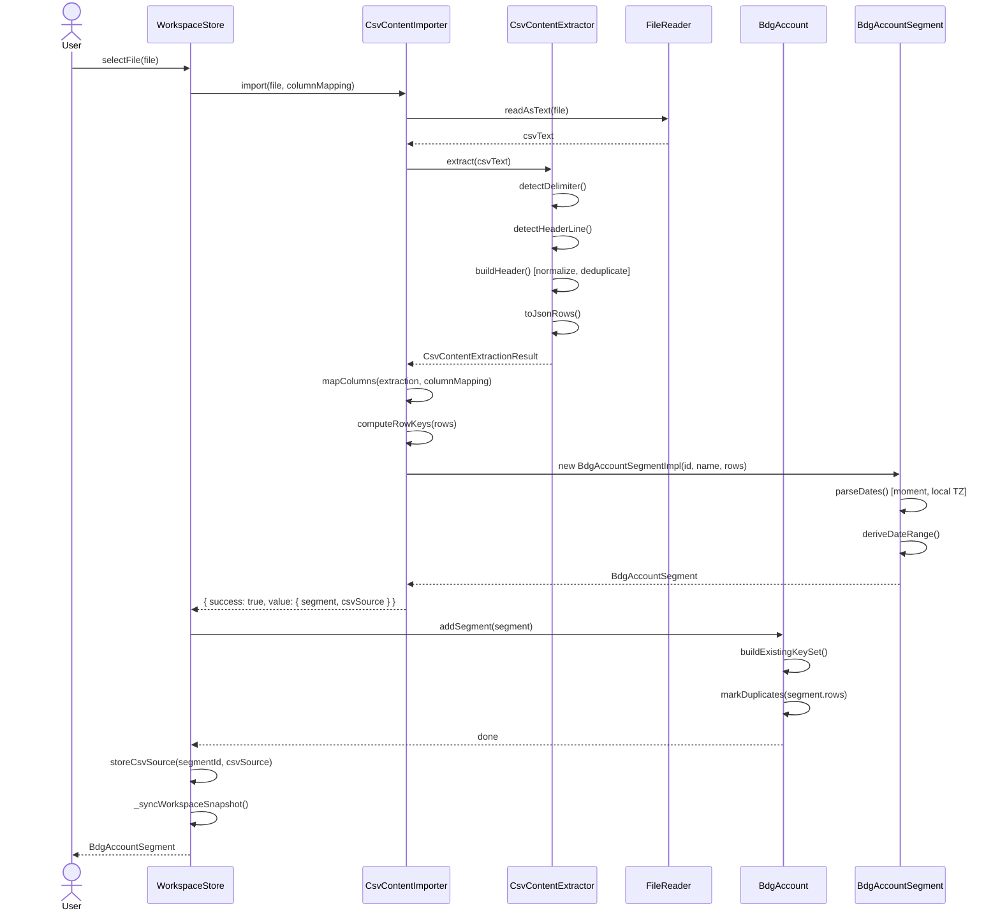
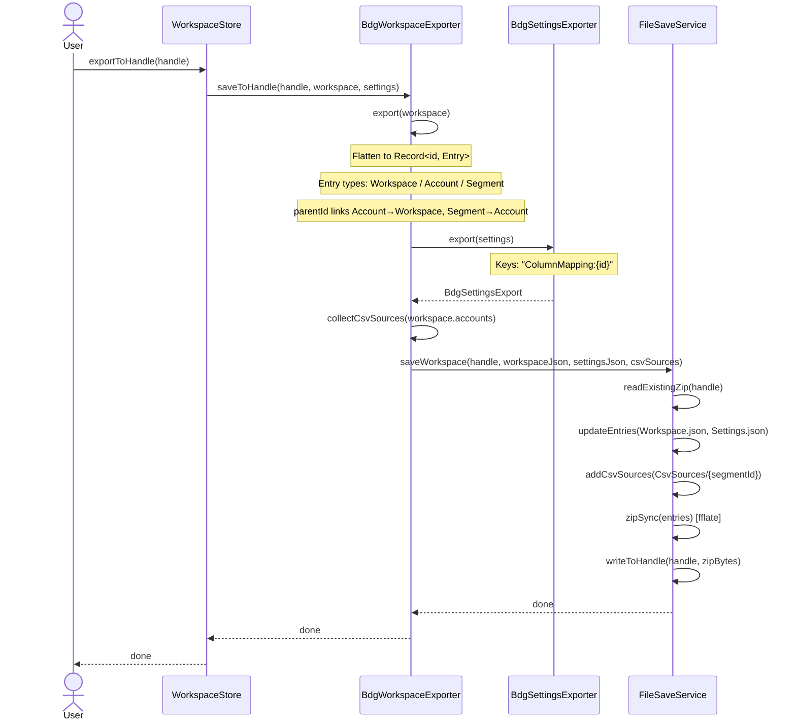
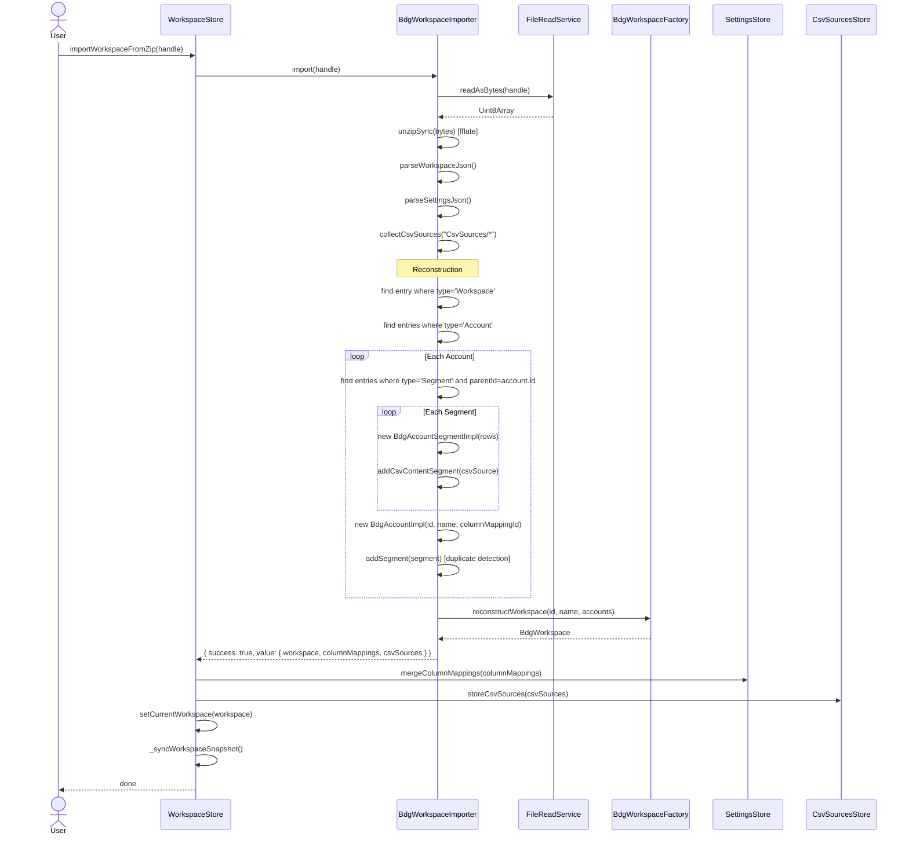

# Engine Architecture

> Source root: `App/src/engine/`  
> The engine is **pure TypeScript** — no Vue, no Pinia, no browser-specific imports (except in service impls that are isolated behind abstractions).

---

## Table of Contents

1. [Module Overview](#1-module-overview)
2. [Dependency Injection](#2-dependency-injection)
3. [Domain Model — Class Diagrams](#3-domain-model--class-diagrams)
   - 3.1 [Workspace Aggregate](#31-workspace-aggregate)
   - 3.2 [Settings Module](#32-settings-module)
   - 3.3 [CSV Import Module](#33-csv-import-module)
   - 3.4 [Infrastructure Services](#34-infrastructure-services)
4. [Sequence Diagrams](#4-sequence-diagrams)
   - 4.1 [CSV Import](#41-csv-import)
   - 4.2 [Workspace Export (ZIP)](#42-workspace-export-zip)
   - 4.3 [Workspace Import (ZIP)](#43-workspace-import-zip)
5. [Workspace File Format](#5-workspace-file-format)
   - 5.1 [ZIP Structure](#51-zip-structure)
   - 5.2 [Workspace.json Schema](#52-workspacejson-schema)
   - 5.3 [Settings.json Schema](#53-settingsjson-schema)
   - 5.4 [CsvSources](#54-csvsources)
6. [Result Pattern](#6-result-pattern)
7. [Key Invariants](#7-key-invariants)

---

## 1. Module Overview

```
src/
├── engine/                        ← Pure TypeScript — no framework imports
│   ├── types/
│   │   └── result-pattern.ts      ← Result<T>, ResultWithError<T,E>
│   ├── services/                  ← Infrastructure abstractions
│   │   ├── IdGenerator.ts
│   │   ├── FileReaderFactory.ts
│   │   ├── FileReadService.ts
│   │   └── FileSaveService.ts
│   ├── modules/
│   │   ├── csv-import/            ← CSV parsing, column mapping, import
│   │   │   ├── csv-column-content.ts
│   │   │   ├── csv-content-extractor.ts
│   │   │   └── csv-content-importer.ts
│   │   ├── bdg-settings/          ← Column mapping configuration
│   │   │   ├── bdg-settings.ts
│   │   │   ├── bdg-column-mapping.ts
│   │   │   └── bdg-settings-exporter.ts
│   │   └── bdg-workspace/         ← Core domain aggregate
│   │       ├── bdg-workspace.ts
│   │       ├── bdg-account.ts
│   │       ├── bdg-account-segment.ts
│   │       ├── csv-content-segment.ts
│   │       ├── bdg-workspace-factory.ts
│   │       ├── bdg-workspace-exporter.ts
│   │       └── bdg-workspace-importer.ts
│   └── setup-inversify.module.ts  ← DI bindings
│
├── inversify/
│   ├── setup-inversify.ts         ← Global container
│   └── inversify-utils.ts
│
└── engine-testapp/
    └── stores/                    ← Pinia bridge (Vue layer)
        ├── workspace-store.ts
        ├── settings-store.ts
        └── csv-sources-store.ts
```

Dependency flow is strictly unidirectional:

```
engine/ (pure TS)  ←  engine-testapp/stores/ (Vue/Pinia bridge)  ←  Vue components
```

---

## 2. Dependency Injection

All services are registered as **abstract classes** that double as InversifyJS tokens. The concrete `Impl` is what is instantiated.



---

## 3. Domain Model — Class Diagrams

### 3.1 Workspace Aggregate



**Key invariants for `addSegment`:** when adding a segment, `BdgAccountImpl` builds the set of all existing row keys across every segment already present. Any incoming row whose computed key is already in that set gets `duplicateOf` set to the matching key. This enables cross-import duplication detection.

---

### 3.2 Settings Module



---

### 3.3 CSV Import Module



**Column mapping values are column indices** into the extracted `header` array. The importer reads each CSV row and picks the value at the mapped index for each semantic field.

---

### 3.4 Infrastructure Services



---

## 4. Sequence Diagrams

### 4.1 CSV Import



---

### 4.2 Workspace Export (ZIP)



---

### 4.3 Workspace Import (ZIP)



---

## 5. Workspace File Format

A workspace is persisted as a **ZIP archive** (`.bdg`) using [fflate](https://github.com/101arrowz/fflate).

### 5.1 ZIP Structure

```
workspace.bdg  (ZIP)
├── Workspace.json
├── Settings.json
└── CsvSources/
    ├── {segmentId-1}
    ├── {segmentId-2}
    └── ...
```

| Entry | Content |
|---|---|
| `Workspace.json` | Flat `Record<string, WorkspaceEntry>` — all workspace/account/segment data |
| `Settings.json` | Flat `Record<string, SettingsEntry>` — column mapping configurations |
| `CsvSources/{segmentId}` | Raw UTF-8 CSV text for the segment — used for re-import or audit |

---

### 5.2 Workspace.json Schema

The file is a **flat dictionary** keyed by entity ID. Parent–child relationships are encoded via `parentId`.

```json
{
  "{workspaceId}": {
    "type": "Workspace",
    "id": "{workspaceId}",
    "name": "My Budget"
  },
  "{accountId}": {
    "type": "Account",
    "id": "{accountId}",
    "parentId": "{workspaceId}",
    "name": "Chequing",
    "columnMappingId": "{columnMappingId}"
  },
  "{segmentId}": {
    "type": "Segment",
    "id": "{segmentId}",
    "parentId": "{accountId}",
    "name": "January 2026",
    "dateStartAsString": "2026-01-01",
    "dateEndAsString": "2026-01-31",
    "csvSourceFilename": "statement_jan2026.csv",
    "rows": [
      {
        "key": "1234|2026-01-15|−45.00|GROCERY STORE",
        "cardNumber": "1234",
        "description": "GROCERY STORE",
        "dateTransactionAsString": "2026-01-15",
        "dateInscriptionAsString": "2026-01-16",
        "amount": -45.00,
        "duplicateOf": null
      }
    ]
  }
}
```

**Entry type summary:**

| `type` | Key fields | `parentId` |
|---|---|---|
| `"Workspace"` | `id`, `name` | — |
| `"Account"` | `id`, `name`, `columnMappingId` | `workspaceId` |
| `"Segment"` | `id`, `name`, `dateStartAsString`, `dateEndAsString`, `csvSourceFilename?`, `rows[]` | `accountId` |

**Row key computation:**

```
key = cardNumber + "|" + dateTransactionAsString + "|" + amount + "|" + description
```

The key is used for duplicate detection when adding a segment to an account. Rows with `duplicateOf` set are still persisted so the user can see and resolve them.

> **Note:** `dateTransaction` and `dateInscription` (`Date` objects) are **not** stored. They are re-derived from the `*AsString` fields on import using `moment` with local-timezone parsing.

---

### 5.3 Settings.json Schema

```json
{
  "ColumnMapping:{id}": {
    "id": "{id}",
    "name": "My Bank Format",
    "columnMapping": {
      "card-number": 0,
      "date-transaction": 2,
      "amount": 4,
      "description": 3,
      "date-inscription": 1
    }
  }
}
```

Each value in `columnMapping` is a **0-based column index** into the CSV header row.  
Fields are optional — a mapping only needs to cover the columns present in the source CSV.

---

### 5.4 CsvSources

Each file under `CsvSources/` is named by the **segment ID** (no extension) and contains the raw UTF-8 CSV text exactly as uploaded by the user. These files are:

- Used for re-display or re-parsing if the column mapping changes
- Carried forward on re-export so the ZIP always contains the original source data
- Not required for the workspace to function — missing sources are gracefully ignored

---

## 6. Result Pattern

All fallible operations return a discriminated union instead of throwing:

```typescript
// Success or failure, no error detail
type Result<T> =
  | { success: true;  value: T }
  | { success: false }

// Success or typed failure
type ResultWithError<T, E> =
  | { success: true;  value: T }
  | { success: false; error?: E }
```

**Usage example:**

```typescript
const result = workspace.getAccount(id)
if (result.success) {
  console.log(result.value.name)  // TypeScript narrows to { success: true, value: BdgAccount }
}
```

Exceptions are only thrown for **programming errors** (e.g. constructing a segment with zero rows, adding a duplicate column mapping ID). Expected runtime failures — file I/O, CSV parsing, ZIP reading — always return `ResultWithError`.

---

## 7. Key Invariants

| Entity | Invariant |
|---|---|
| `BdgAccountSegmentImpl` | `rows` array must be non-empty (constructor throws otherwise) |
| `BdgAccountSegmentImpl` | Dates parsed with `moment` in **local timezone** — never `new Date(string)` |
| `BdgAccountSegmentRow.key` | Computed as `cardNumber\|dateTransactionAsString\|amount\|description` |
| `BdgAccountImpl.addSegment` | Scans all existing segments for row key collisions; marks duplicates via `duplicateOf` |
| `BdgSettingsImpl` | Column mapping IDs must be globally unique; add/update/remove enforce this |
| `BdgWorkspaceImpl` | Accounts stored in `Map<id, BdgAccount>`; `getAccount` returns `Result<T>` |
| `WorkspaceSnapshot` | `Date` objects are **omitted**; strings are the source of truth for persistence |
| `IdGenerator` | Must be injected — **never** call `crypto.randomUUID()` directly |
