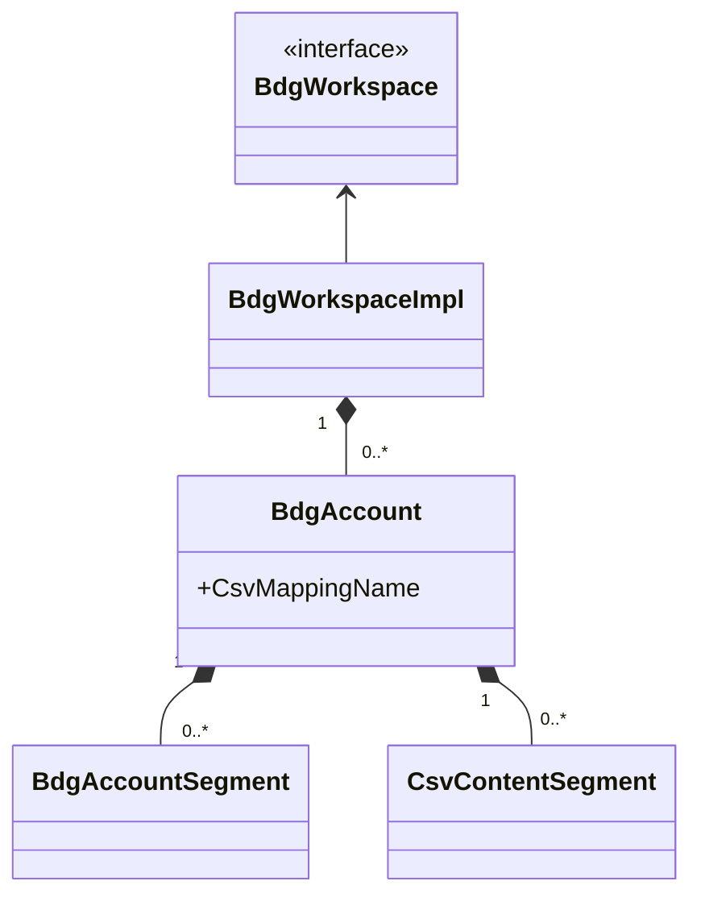

```mermaid
classDiagram
    class BdgWorkspace {
        <<interface>>
    }
    class BdgWorkspaceImpl
    class BdgAccount {
        +CsvMappingName
    }
    class BdgAccountSegment
    class CsvContentSegment
    
    BdgWorkspace <-- BdgWorkspaceImpl
    BdgWorkspaceImpl "1" *-- "0..*" BdgAccount
    BdgAccount "1" *-- "0..*" BdgAccountSegment
    BdgAccount "1" *-- "0..*" CsvContentSegment
```