# BUDGAN

# Description

This is a budgeting application designed to help users manage their finances effectively. It provides features such as tracking income and expenses.
For now it's very simple but there's plans to have it evolved with more ways to analyze a budget
and even in the future some budget planning.

One of the goal of this application is to keep it simple and AI free: you own and keep your data.
There's no server, data is kept in the browser or in a local file when you save it. You can always clear the browser data content from the app itself.

It's designed as a PWA (Progressive Web App) which means it can be installed on your device and used offline. It also provides a native-like experience with features like push notifications and app shortcuts.

# Application architecture

This application is build using Angular / TypeScript and uses IndexDB to store the data locally.
File content is saved as JSON so it can be easily loaded and saved.

There's an architecture document located in the Doc folder : [Architecture.md](./Doc/Architecture.md)

# Security

The main way this application keeps your data secure is by not relying on any server nor
using any AI sending your data in the cloud.  All the data is kept locally in the browser or
in a location of your choosing when saving a file.

# How it works

It all starts from you saving your bank statements locally in CSV format.

## Setting a column mapping

You then can create a mapping (tell the application which column is what) in the file.
The application let you use your statement csv file to help you select the columns.

This is required because each bank have a different csv format. It's also possible within
the same bank to have different format for account and credit cards.

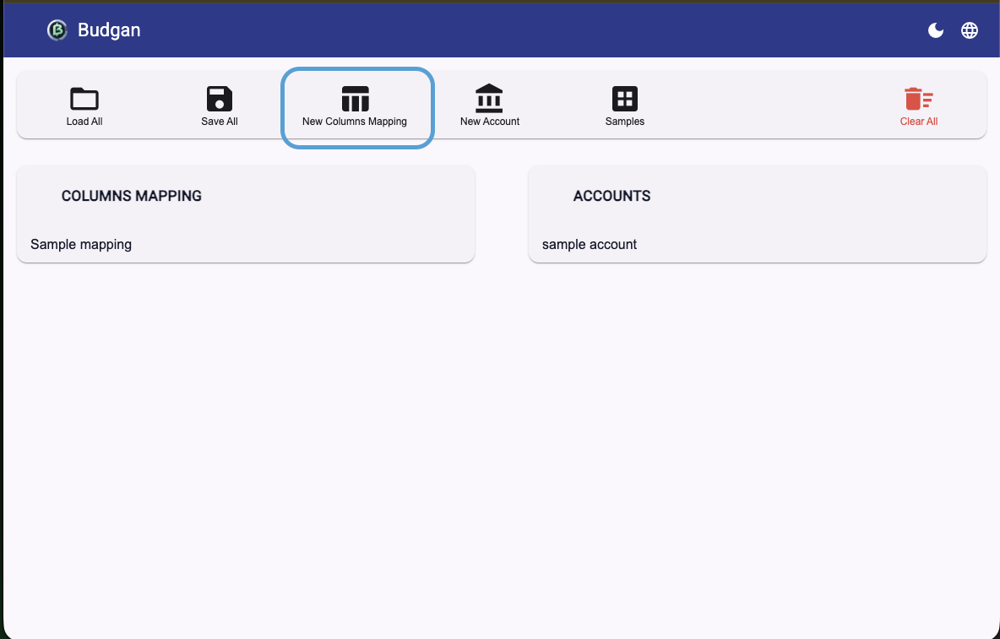

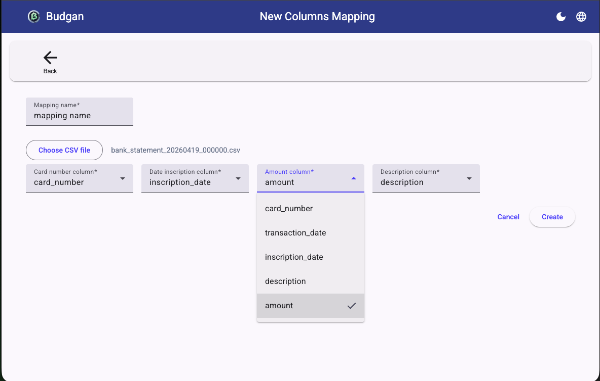

The new mapping will appear on the home page in the card named "Columns mapping".

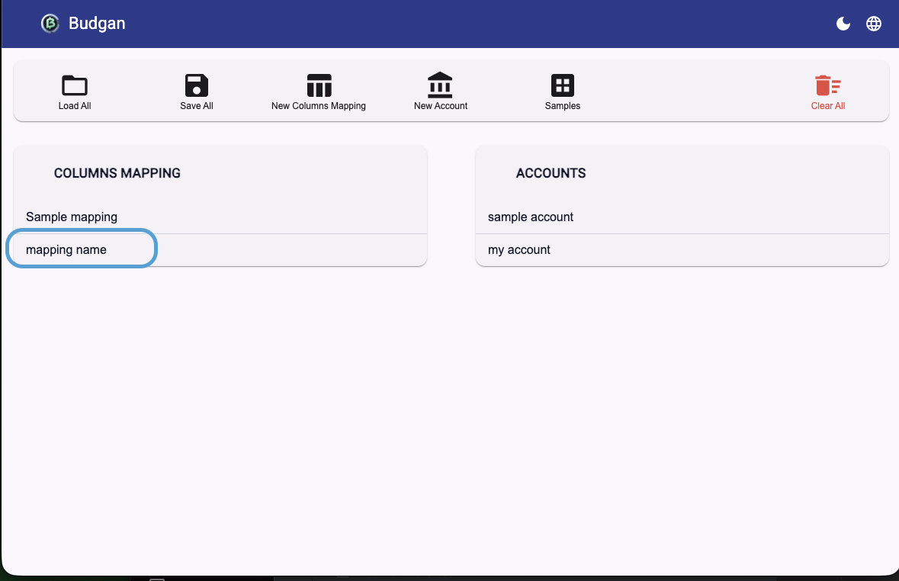

You can view the mapping by selecting it.
The number in parentheses indicates the column index in the CSV file.

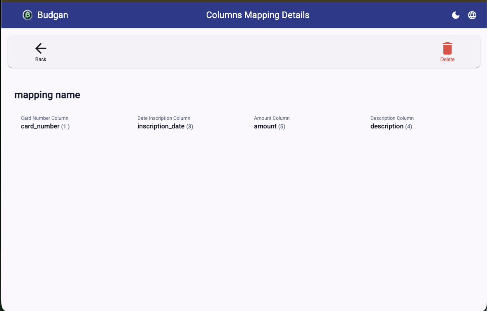

## Creating an account

When creating an account, you need to provide the column mapping this account will use when importing statements.

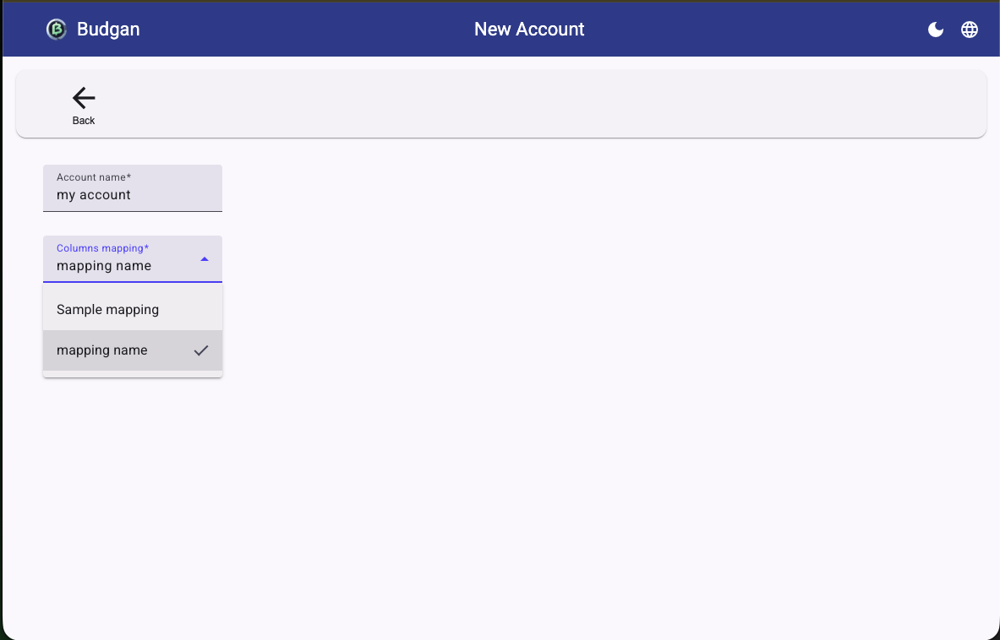

The new account will appear on the home page in the card named "Accounts".

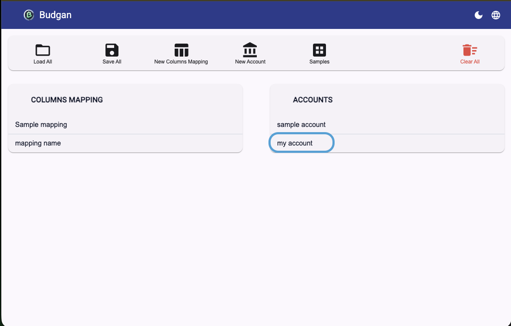

## Importing statements

Importing a statement is done from the account page by selecting "import file".

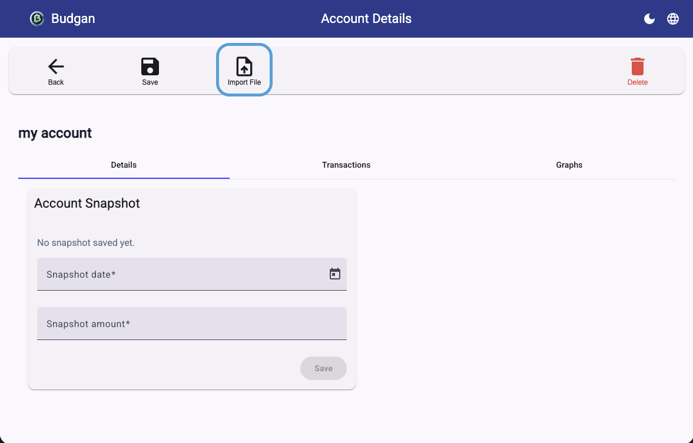

## Account information

The application allow you to view the transactions over time.  You can also choose which column to order from in ascending or descending order.
It will estimate a balance account value after each transaction.  By default this balance starts at 0.

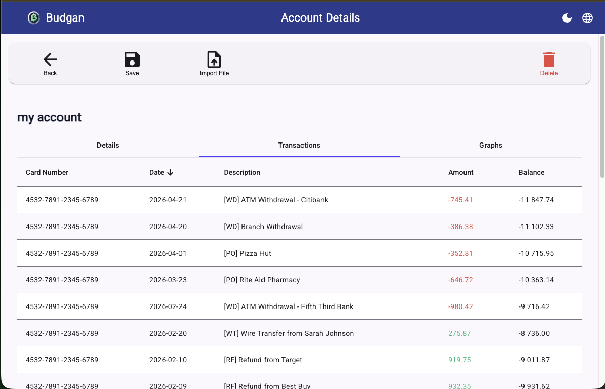

There's also a graph view of the balance over time.

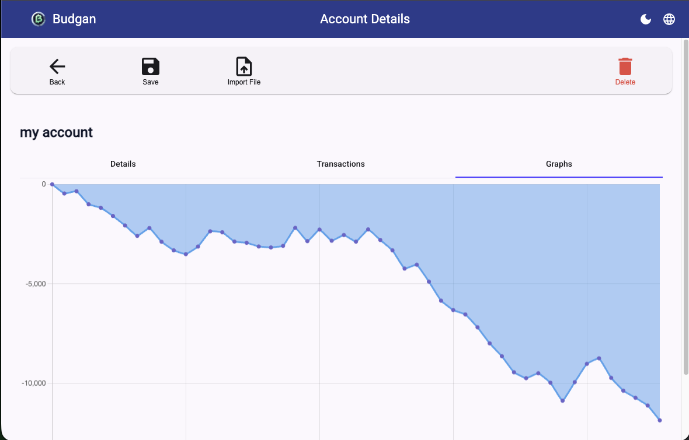

### Snapshot balance

On the detail tab of the account, it's possible to set a balance snapshot that will be used to calculate the balance for each transaction instead of starting at 0.
This snapshot can be at any point in time.  The application will calculate a starting point from the given snapshot.

For example, here we set a snapshot on Jan 1st, 2026 of $10 000.

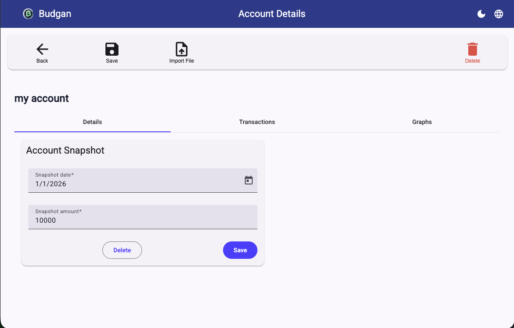

The transactions table will adjust accordingly. And the snapshot it represented in a row with black text for the amount.

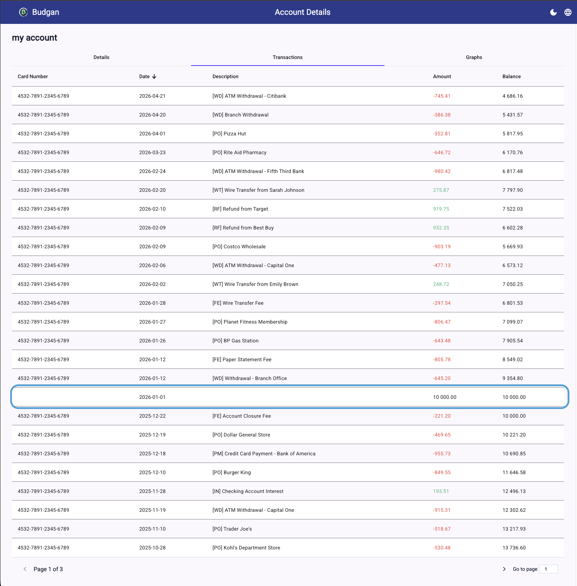

The graph also represent the new data with the snapshot.

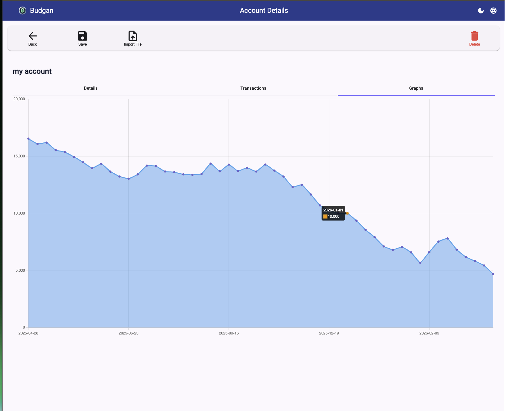

## Save / Load / Clear

At any time you can save your data using the "Save All" button on the home page.  
You can also load a previous saved file using the "Load All" button.  

At any time you can erase all data from the browser by using the "Clear All" button.

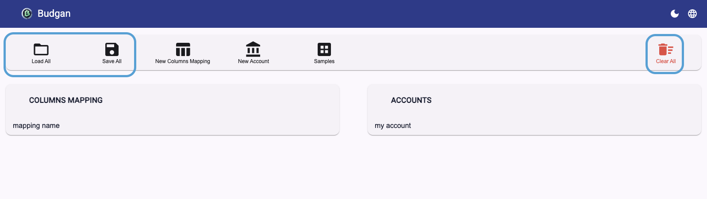

